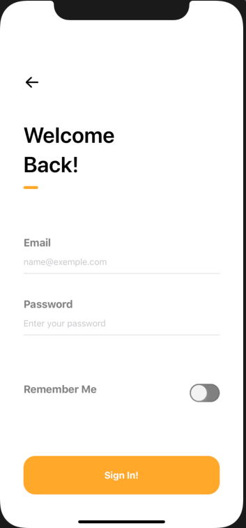
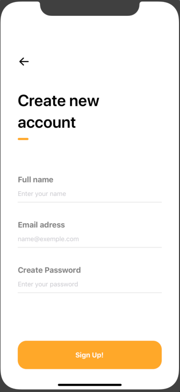
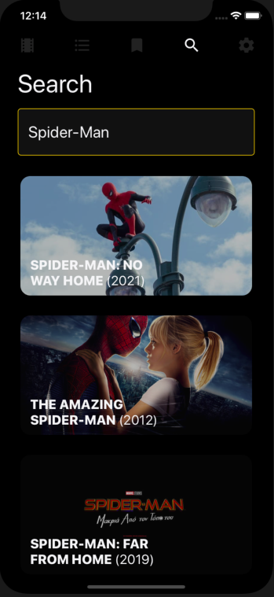
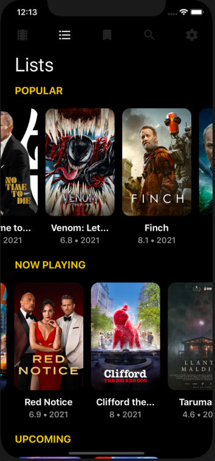
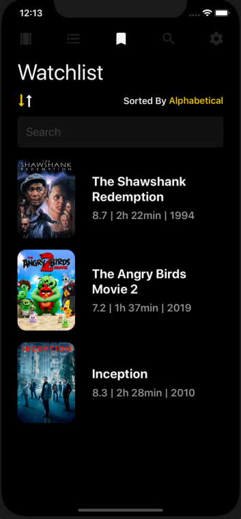
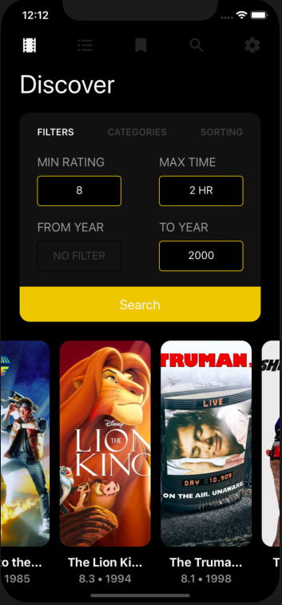

# MovieApp-ReactNative

Find the perfect movie to watch you didn’t even know exist. Just tell filmless what you’re into, and we’ll do the rest.

Welcome Page            |  SignUp Page           |  SignIn Page
:-------------------------:|:-------------------------:|:-------------------------:
  |     |   

Welcome Page            |  SignUp Page           |  SignIn Page    |  SignIn Page
:-------------------------:|:-------------------------:|:-------------------------:|:-------------------------:
  |     |    |   


# running the project

In order to run the project, you need to first create a `env.js` file in the root of the project.

```
const API_KEY = 'yourapikey';

export default API_KEY;
```

The API key is a private key generated from TMDb. To generate an API key [visit this link](https://developers.themoviedb.org/3/getting-started/introduction).

You can then run the app by running:

Run the server:
```sh
cd server/
npm i
npm run dev
```

Run the client:
```sh
cd client/
yarn
expo start
i
```
